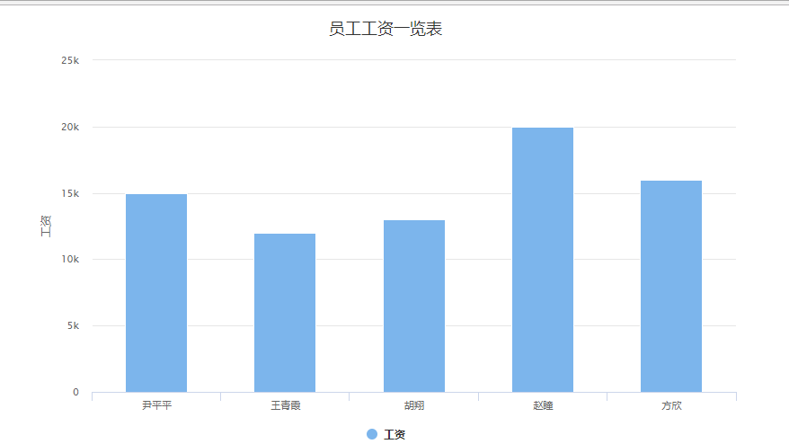

# -jQuery-Ajax-HighCharts-
在JavaEE企业级项目开发中，很多项目都会用到数据的统计和图表的展示功能，如：各种股票系统，银行的资金结算，公司的财务报表等等。如何快速高效的开发这些图表是一件麻烦的事。该项目讲解一个优秀的工具——HighCharts来帮助大家实现这类功能

# HighCharts综合应用案例

### 开发环境与开发组件：

1. 开发工具Intellij IDEA 
2. jQuery 3.2.1+ Highcharts-6.0.7
3. Web容器：Tomcat8.5
4. 数据库MySQL 5.5.4
5. 数据库访问技术：C3P0连接池+DbUtils工具包
6. Web层：Servlet3.0 + HTML5
7. flexjson将数据库查询到的数据转成JSON格式
8. 使用JUnit进行单元测试

### 案例需求：

1. 下面我们利用jQuery+Ajax+HighCharts打造一个项目图表，显示所有员工的表格数据和矩形图。
2. 在mysql数据库中有如下表和数据
*****************************************
  
*****************************************
3. 将员工信息从数据库中读取出来以柱形图的方式显示在HTML页面上
******************************************
